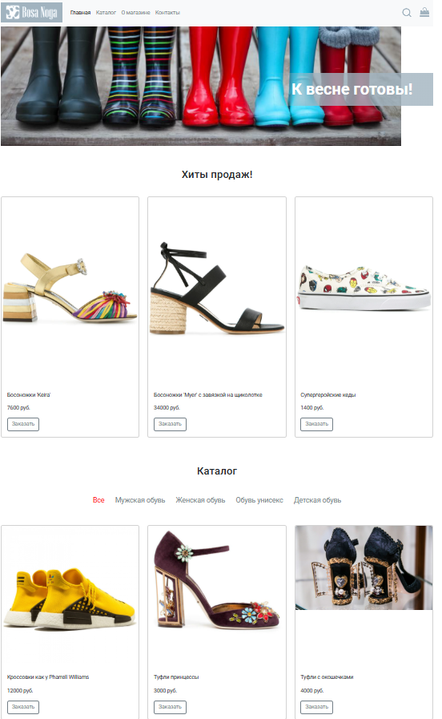
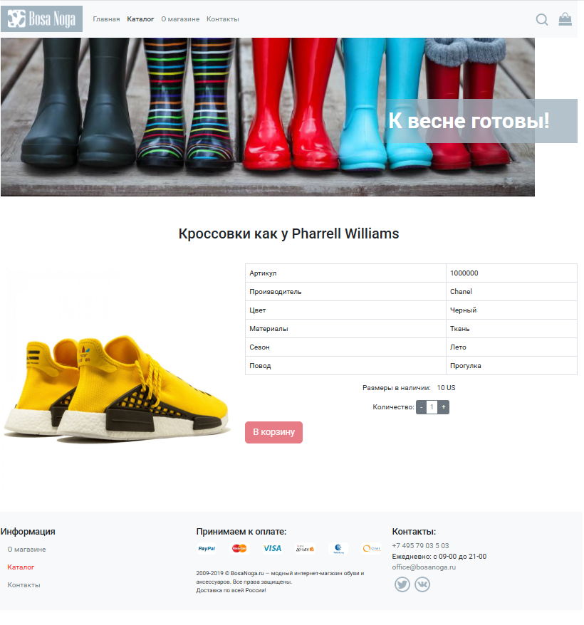
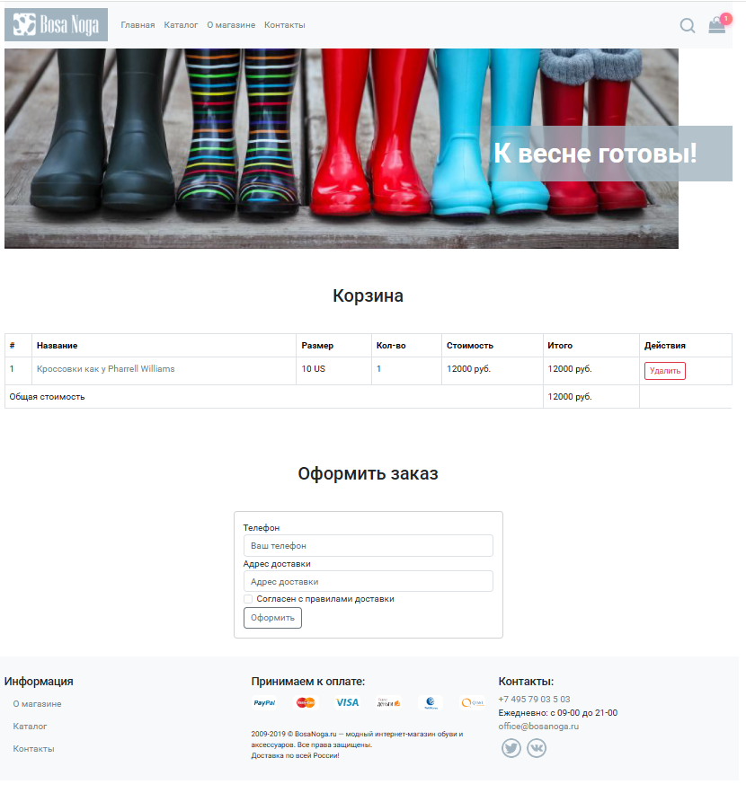

[](https://ci.appveyor.com/project/AntonyCoder/shoes-store)

# Интернет-магазин обуви

Современное веб-приложение для продажи обуви, разработанное с использованием React и TypeScript. Проект реализует полнофункциональный интернет-магазин с каталогом товаров, корзиной покупок, системой поиска и управлением состоянием через Redux.

Проект доступен по ссылке(https://antonycoder.github.io/Shoes-Store/)
Бэкенд работает с задержкой потому что выложен на сервер с бесплатным тарифом.

## 🚀 Технологический стек

- **React 19.1.1** — библиотека для построения пользовательского интерфейса
- **TypeScript** — типизированный JavaScript для повышения надежности кода
- **Redux Toolkit** — управление глобальным состоянием приложения
- **React Router DOM** — постраничная навигация и роутинг
- **Bootstrap 5.3.8** — CSS-фреймворк для адаптивного дизайна
- **Vite** — современный инструмент сборки и разработки

## ✨ Основной функционал

### Навигация и структура

- **Постраничный роутинг** — реализована полноценная система маршрутизации с использованием React Router DOM
- **Шапка и футер** — единообразные компоненты навигации и информации о магазине на всех страницах
- **Статичные страницы**:
  - Страница 404 (NotFound) — обработка несуществующих маршрутов
  - Страница "О магазине" — информация о компании
  - Страница "Контакты" — контактная информация

### Каталог товаров

- **Компонент "Хиты продаж"** — отображение популярных товаров на главной странице
- **Каталог** — компонент для отображения товаров:
  - На главной странице — превью каталога
  - На странице каталога — полный каталог с фильтрацией
- **Поиск** — функционал поиска товаров по названию и описанию
- **Детальная страница товара** — просмотр подробной информации о выбранном товаре

### Корзина и заказы

- **Корзина покупок** — добавление, удаление и изменение количества товаров
- **Оформление заказа** — форма для завершения покупки
- **Глобальное состояние корзины** — управление корзиной через Redux для синхронизации данных между компонентами

### Управление состоянием

- **Redux Toolkit** — централизованное управление состоянием приложения
- **Redux Thunks** — асинхронные действия для работы с API

### Работа с данными

- **HTTP-запросы** — интеграция с REST API для получения данных о товарах
- **Обработка загрузки** — компонент Loader для отображения состояния загрузки
- **Обработка ошибок** — корректная обработка ошибок при работе с API

## 📁 Структура проекта

```
shoes-store/
├── src/
│   ├── app/              # Конфигурация Redux store и root reducer
│   ├── assets/           # Статические ресурсы (изображения)
│   ├── components/       # React компоненты
│   │   ├── About/        # Страница "О магазине"
│   │   ├── Banner/       # Баннер магазина
│   │   ├── Cart/         # Корзина покупок
│   │   ├── Catalog/      # Каталог товаров
│   │   ├── CatalogItem/  # Элемент каталога
│   │   ├── Contacts/     # Страница контактов
│   │   ├── Footer/       # Футер сайта
│   │   ├── Header/       # Шапка сайта
│   │   ├── Loader/       # Индикатор загрузки
│   │   ├── NotFound/     # Страница 404
│   │   ├── Product/      # Детальная страница товара
│   │   ├── Search/       # Компонент поиска
│   │   └── TopSales/     # Хиты продаж
│   ├── features/         # Redux слайсы и thunks
│   │   ├── cart/         # Состояние корзины
│   │   ├── catalog/      # Состояние каталога
│   │   ├── catalogItem/  # Состояние товара
│   │   ├── categories/   # Состояние категорий
│   │   └── topSales/     # Состояние хитов продаж
│   ├── layouts/          # Макеты страниц
│   ├── pages/            # Страницы приложения
│   ├── routes/           # Конфигурация роутинга
│   ├── services/         # Сервисы для работы с API
│   ├── styles/           # Глобальные стили
│   └── utils/            # Вспомогательные утилиты
├── package.json
└── vite.config.ts
```

## 🛠️ Установка и запуск

### Предварительные требования

- Node.js (версия 18 или выше)
- npm или yarn

### Установка зависимостей

```bash
npm install
```

### Запуск в режиме разработки

```bash
npm run dev
```

Приложение будет доступно по адресу `http://localhost:5173`


## 📸 Скриншоты интерфейса

<!-- Здесь будут размещены скриншоты интерфейса приложения -->

### Главная страница


### Страница каталога


### Страница товара


### Корзина и оформление заказа


## 📝 Особенности реализации

- **TypeScript** — полная типизация компонентов и данных
- **Модульная архитектура** — разделение на компоненты, страницы, сервисы и features
- **Оптимизация производительности** — эффективное управление состоянием через Redux
- **Обработка ошибок** — корректная обработка ошибок при работе с API
- **UX/UI** — индикаторы загрузки и понятный интерфейс
